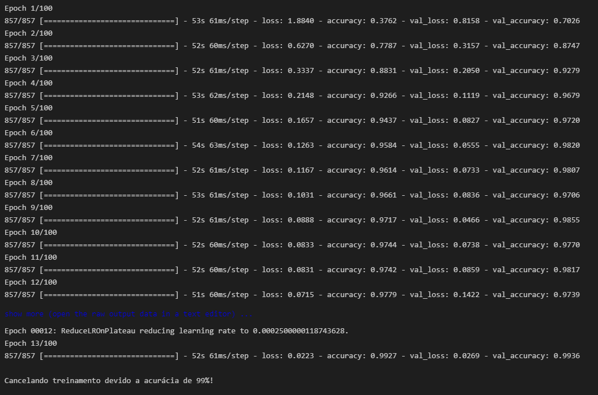
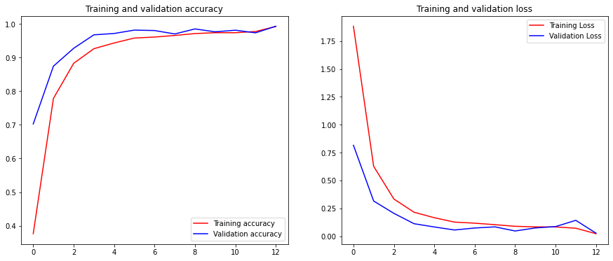
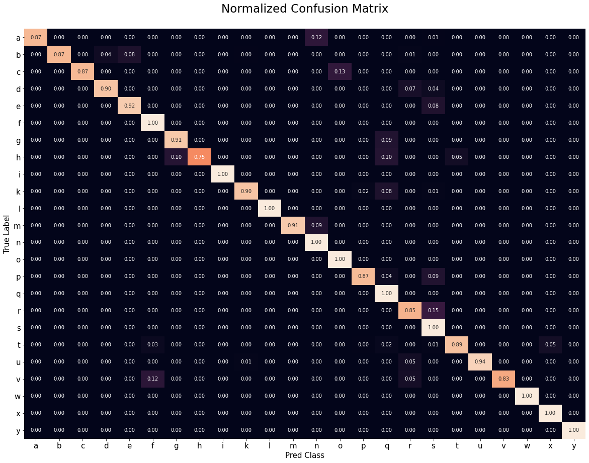
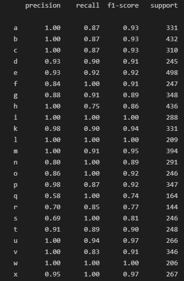
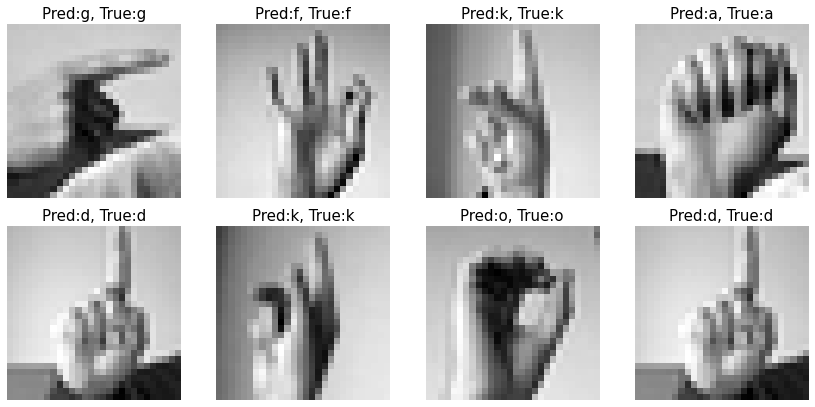
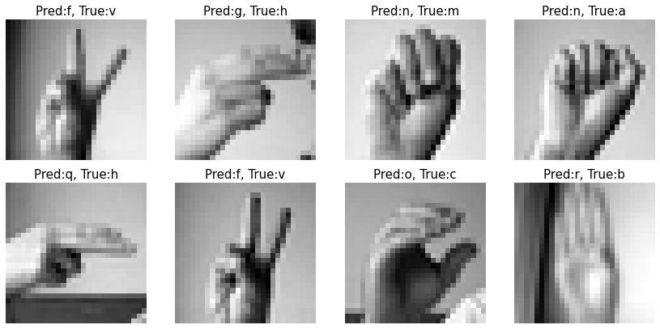
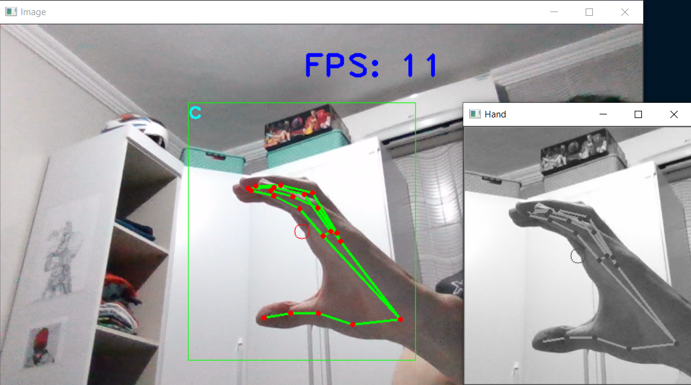
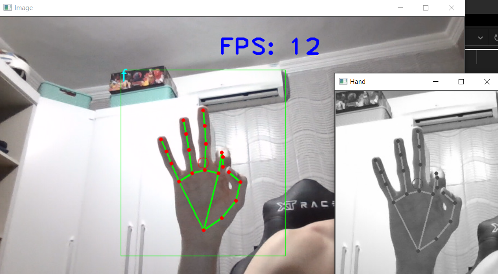
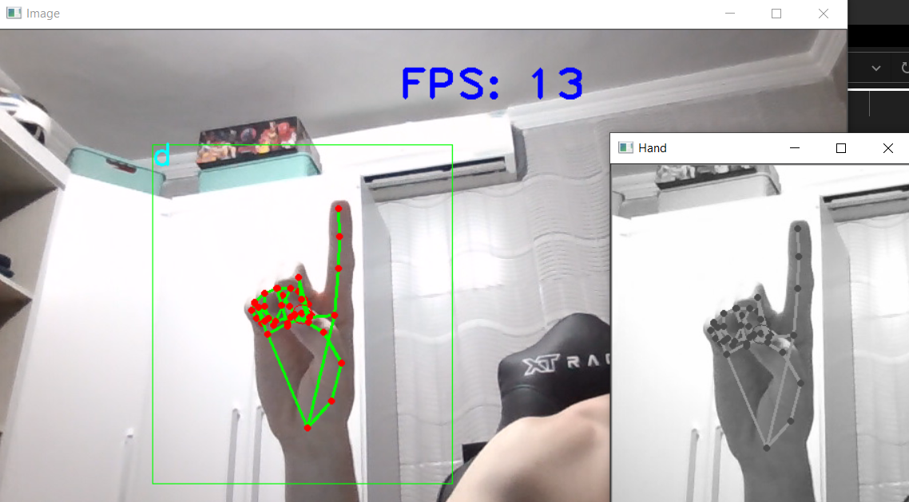
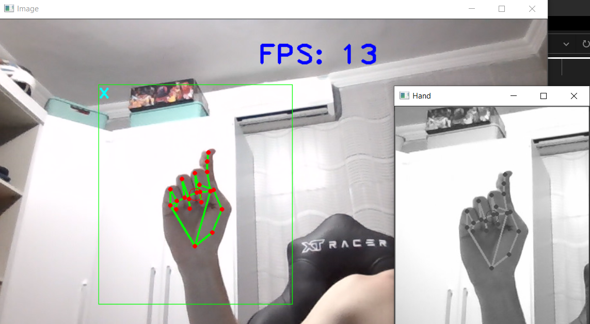

# Projeto de reconhecimento do alfabeto de libras em tempo real

Projeto de detecção das letras do alfabeto de libras usando o **TensorFlow** para a estruturação da parte de aprendizado e **OpenCV** para a captura em tempo real das imagens.

## Exemplo das letras do alfabeto:

    

Para esse projeto não iremos trabalhar com algumas letras em específico, como o "J" e o "Z", que na linguagem de sinais são representados por um movimento e não por uma posição estática.

    

## Rede Neural Convolucional (CNN)

A arquitetura da rede que vai ser utilizada nesse projeto consiste de uma serie de camadas covolucionais para a detecção de features importantes de cada imagem.

### Dados do treinamento

É possível perceber que a rede conseguiu identificar rapidamente as features mais importantes e foi melhorando a função custo e a acurácia constantemente.

    

Vale destacar que o callback de redução do learning rate foi ativado uma vez perto final do treinamento, o que contribuiu consideralvemnte para a melhora da acurácia do modelo, fazendo ele conseguir atingir os 99% e assim, parando o treinamento previamente.

Ao final do treinamento os seguintes gráficos foram obtidos.

    

Além disso, vale destacar algumas métricas importantes para a validação do modelo.

#### Confusion Matrix

    

As taxas de acerto das predições corretas estão bem altas e os casos em que foi observados mais erros são de letras que realmente tem muita semelhança.

#### Classification Report

    

#### Análise de Casos Corretos e Incorretos

##### Casos Corretos

    

##### Casos Incorretos

    

É possível perceber que o modelo ficou bem construido e que está errando muito pouco.

## Predição em Tempo Real

Para isso vamos construir um programa para capturar a imagem e realizar o tratamento, utilizando **OpenCV**.

### Exemplos de predições feitas em tempo real.

  

    
    
    
    
  

